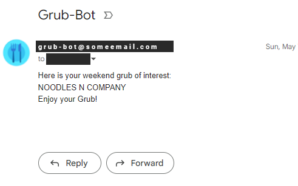

# Grub Recommendation Bot (SMTP/SMS)

> A simple weekly restaurant suggestion bot service.

<!---->

## Overview
Utilizes GitHub Actions and Cronjob Scheduling with SMTP/Email and SMS messaging services.
- **GitHub Action Workflow** builds and runs the job every **Friday**, at **12:00PM**. `(00 12 * * 5)`
- A random Restaurant is selected from a list of available/nearby restaurants, that have the `lowest` visitation integer.
- A random message prompt is also determined, and is sent to multiple **Emails and Phone Numbers**.

> *Note: Phone Numbers, Emails, and Webhooks are stored for security through **Secrets** on the public repository.*

 

Future integrations will include: `Google Maps API`, `Discord Bot/Webhooks`

## SMS/SMTP Demo

Once the `Workflow Job` finishes, an SMS/SMTP message is sent to the available end-users.
- All Email Address and PHone Numbers on this Repo are safely stored as environment variables and GitHub secrets.
- When the `Workflow Job` executes, it will pull the Secret from the repo into a local environment var on the server instance.
- The script will ping each SMS/SMTP destination found within the converted list of Addresses.

    

## Resources
- https://www.verizon.com/about/news/vzw/2013/06/computer-to-phone-text-messaging  
